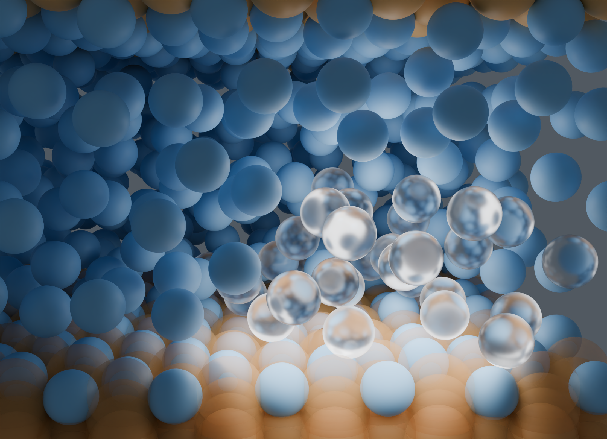

# Vibration-Induced Ice Nucleation MD Datasets

This repository collects simulation inputs, analysis scripts, and figure data from two molecular-dynamics studies of vibration-induced ice nucleation.



## Studies

| Directory | Study | Authors | Contents |
| --- | --- | --- | --- |
| [`studies/nanoscale`](studies/nanoscale) | *Nanoscale insights into vibration-induced heterogeneous ice nucleation* | Pengxu Chen, Rohit Pillai, Saikat Datta | Figure 2–6 data and MATLAB scripts; a complete LAMMPS/Slurm sample workflow; a custom LAMMPS fix |
| [`studies/jcp`](studies/jcp) | *Freezing under motion: How surface vibrations suppress ice nucleation in water nanofilms* | Pengxu Chen, Patrick Sullivan, Rohit Pillai, Saikat Datta | Figure 2–7 data and MATLAB scripts; LAMMPS trajectories; static and vibrating-surface sample workflows |

Scripts are grouped with their input data because several analyses expect files to be available in the current working directory. Study-specific details are provided in each directory's `README.TXT` files.

## Repository layout

```text
vibice-md/
├── README.md
├── CITATION.cff
├── LICENSE
├── LICENSES/
├── docs/
│   └── assets/
└── studies/
    ├── nanoscale/
    │   ├── Figure2/ ... Figure6/
    │   └── Sample_case/
    └── jcp/
        ├── FIG2/ ... FIG7/
        └── Sample_case/
```

## Reproducing the analyses

Clone the repository with Git, then run a MATLAB script from the directory that contains it and its input data. For example:

```matlab
cd studies/jcp/FIG5/b
MB
```

The LAMMPS examples are documented in each study's `Sample_case/README.TXT`. The Nanoscale workflow progresses through `a_init`, `b_equil`, `c_ramping`, `d_config`, and `e_meas`. The JCP workflow progresses through `a_init`, `b_ramp`, `c_equil`, and `d_meas`.

Requirements depend on the selected workflow:

- MATLAB for figure reconstruction and trajectory analysis.
- LAMMPS and the included `mW.sw` potential files for simulations.
- A C++ compiler to build the Nanoscale `fix_movenve` extension. Its original notes specify LAMMPS version `23Jun2022`.
- Slurm for the automated Nanoscale measurement campaign.

Machine-specific paths, scheduler settings, and simulation parameters remain exactly as deposited and should be reviewed before running a job.

## Licensing

The data and documentation are distributed under the [Creative Commons Attribution 4.0 International License](LICENSE). The LAMMPS-derived C++ extension is governed by the GNU General Public License notices in `fix_movenve.cpp` and `fix_movenve.h`. Additional licensing information is available in [`LICENSES`](LICENSES).
